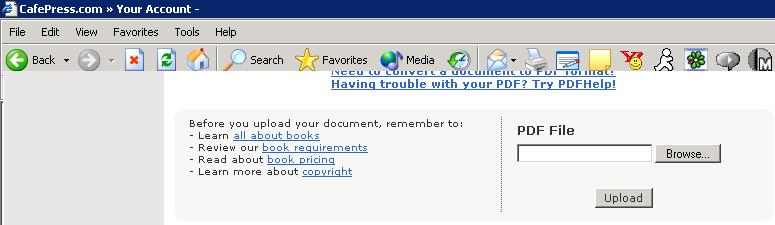

<div align="center">

## Turn your tutorials Into Books Publish your own books


</div>

### Description

I know this is not the place for stuff like this but I found this great site where you can turn your tutorials into books, go ahead flame me, I just know someone will find this useful
 
### More Info
 


<span>             |<span>
---                |---
**Submitted On**   |
**By**             |[OpcodeVoid](https://github.com/Planet-Source-Code/PSCIndex/blob/master/ByAuthor/opcodevoid.md)
**Level**          |Beginner
**User Rating**    |4.2 (21 globes from 5 users)
**Compatibility**  |VB 3\.0, VB 4\.0 \(16\-bit\), VB 4\.0 \(32\-bit\), VB 5\.0, VB 6\.0, VB Script, ASP \(Active Server Pages\) , VBA MS Access, VBA MS Excel
**Category**       |[Miscellaneous](https://github.com/Planet-Source-Code/PSCIndex/blob/master/ByCategory/miscellaneous__1-1.md)
**World**          |[Visual Basic](https://github.com/Planet-Source-Code/PSCIndex/blob/master/ByWorld/visual-basic.md)
**Archive File**   |[](https://github.com/Planet-Source-Code/opcodevoid-turn-your-tutorials-into-books-publish-your-own-books__1-57594/archive/master.zip)


### Source Code

```
The website is at
http://www.cafepress.com/cp/info/storeref.aspx?refby=opcodevoid
<p>
Or http://www.cafepress.com If you don't want to give me rerferal points, I would just like to see Some tutorials in pscode on hardback books(For my sentimental reasons)
```

